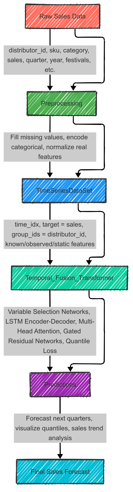
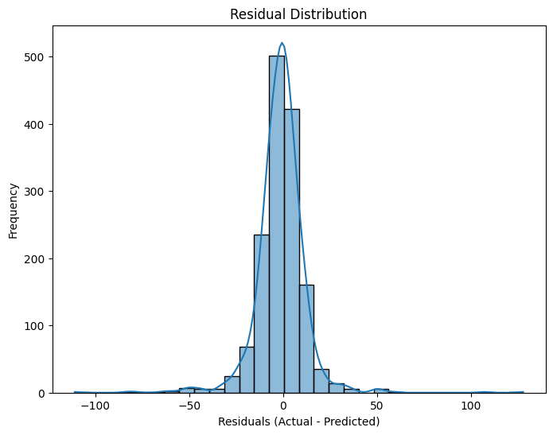

# Sales Forecasting Using Temporal Fusion Transformer (TFT)

              

---

Welcome to the **Sales Forecasting** repository, part of the Sales Prediction Application developed for **INC 2025**.

This repository contains the **Machine Learning model** built using the **Temporal Fusion Transformer (TFT)** architecture.  
The model is designed to **predict quarterly sales** based on historical distributor sales data.

## Project Overview
The primary objective of this project is to accurately forecast future sales for any given quarter by analyzing patterns and trends from previous quarters.  
This forecasting system aims to assist businesses in better demand planning and inventory management.

## Repositories
This is part of a larger project with separate components for the frontend and backend:

- **Frontend Application**: [Sales Forecasting Frontend](https://github.com/harshapeshave641/Demand-Forecasting-Frontend)
- **Backend API**: [Sales Forecasting Backend](https://github.com/harshapeshave641/Demand-Forecasting-Backend)

---

## Model Architecture

The core model is based on the **Temporal Fusion Transformer (TFT)**, a powerful deep learning model for time series forecasting.  
The architecture includes:

- **Variable Selection Networks**: Dynamically select the most relevant input variables.
- **Gated Residual Networks (GRN)**: Process information with skip connections.
- **LSTM Encoder-Decoder**: Capture sequential dependencies in time series.
- **Multi-Head Attention**: Focus on the most relevant past time steps.
- **Static Covariates Encoder**: (optional) Handle features that don't change over time.
- **Quantile Regression Loss**: Predict multiple quantiles (for probabilistic forecasting).

### Model Diagram
---
Here’s a high-level architecture overview:

<!--  -->
<center>

</img>

</center>


```plaintext
RAW SALES DATA
(distributor_id, sku, category, sales, quarter, year, festivals, etc.)
      ↓
⮕ Preprocessing
- Fill missing values
- Encode categorical variables
- Normalize real-valued features
      ↓
⮕ TimeSeriesDataSet (PyTorch Forecasting)
- time_idx = time index (quarter/year)
- target = sales
- group_ids = distributor_id
- known/observed/static features
      ↓
⮕ Temporal Fusion Transformer (TFT)
- Variable Selection Networks
- LSTM Encoder-Decoder
- Multi-Head Attention
- Gated Residual Networks
- Quantile Loss (probabilistic forecasts)
      ↓
⮕ Predictions
- Forecast next quarters
- Visualize quantiles
- Sales trend analysis
```

---
*Note: A detailed visualization of TFT is available in the [original TFT paper](https://arxiv.org/abs/1912.09363).*


## Model Metrics
The model achieves high accuracy in predicting quarterly trends based on previous distributor sales records.




*Prediction Metrics display values on x-axis in ₹ and the frequency on the y-axis*

---

## Future Improvements
- Hyperparameter tuning for even better prediction accuracy
- Incorporating additional external covariates (e.g., economic indicators)
- Using web scraping to predict unforseen economic events
- Deploying an auto-retraining pipeline based on new sales data

---
